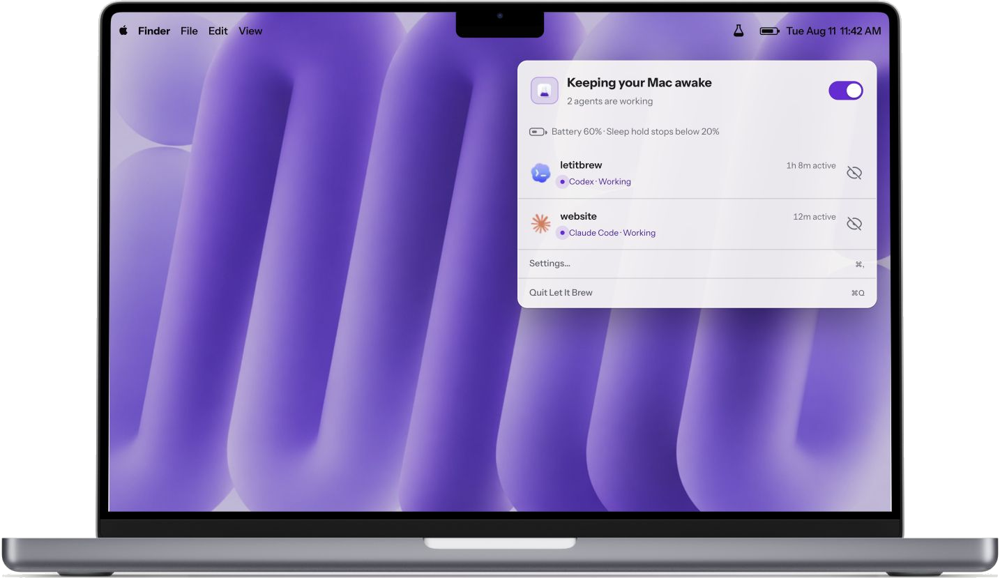

# Let It Brew

**Your Mac sleeps. Your agent dies. Let It Brew fixes that.**

A macOS menu-bar app that keeps your Mac awake while supported local coding
agents work. It lets your Mac sleep as soon as the work stops.

 

[Release notes and SHA-256](https://github.com/ruban-24/letitbrew/releases/latest) &middot;
[letitbrew.app](https://letitbrew.app)

## What it does

You give an agent a task and walk away. The agent works without touching your
keyboard or trackpad, so macOS may decide you are idle and put the Mac to sleep.
Let It Brew follows the agent's real lifecycle and holds the Mac awake only while
work is happening.

- **Follows real work.** The hold starts and stops with supported
  local agent activity.
- **Releases when work stops.** Questions, completion, pause, battery limits, and
  thermal pressure let the Mac sleep.
- **Works with the lid closed.** Active work can continue after you shut the
  MacBook.
- **Stays out of the way.** It has no Dock icon, main window, or notifications.
- **Keeps session data local.** There is no account, cloud service, or telemetry.

## Let It Brew vs Caffeine vs Amphetamine

| Feature | **Let It Brew** | Caffeine | Amphetamine |
|---|---|---|---|
| **Best for** | Claude Code, Codex, OpenCode, and GitHub Copilot CLI work that should keep your Mac awake automatically | A simple manual keep-awake switch | Timers, schedules, and triggers |
| **Understands active agent work** | ✅ Yes — Claude Code, Codex, OpenCode, and GitHub Copilot CLI | ❌ No | ❌ No |
| **Releases when agent work stops** | ✅ Yes — automatically | ❌ No — manual switch or timer | ❌ No — ends with its session or trigger |
| **Closed lid — with charger** | ✅ Yes | ❌ No | ✅ Yes |
| **Closed lid — without charger** | ✅ Yes | ❌ No | ❌ No |
| **Agent-specific integration** | ✅ Claude Code, Codex, OpenCode, and GitHub Copilot CLI | ❌ None | ❌ None |

See the [full comparison and guidance](https://letitbrew.app/compare/let-it-brew-vs-caffeine-vs-amphetamine).
If you want a general-purpose keep-awake utility, Caffeine and Amphetamine are
good at that. Let It Brew follows coding-agent sessions.

## Supported agents

| Agent | Local surfaces | Connection |
|---|---|---|
| Claude Code | CLI and local desktop code sessions | Lifecycle hooks after workspace trust |
| Codex | CLI and local app sessions | Lifecycle hooks plus Codex trust approval |
| OpenCode | Stable 1.x local CLI/app runtime | Global OpenCode plugin |
| GitHub Copilot CLI | Local CLI | Copilot user hooks |

Let It Brew observes local sessions only. Remote, cloud, SSH, and unsupported
hook scopes are not observed.

Connections are optional. Let It Brew changes no agent configuration until you
turn on an agent's watched switch. Turning it off removes only the entry or
plugin that Let It Brew owns. See the
[agent hook contracts](docs/AGENT-HOOK-CONTRACTS.md) for the exact integration
boundaries.

## Install

1. [Download the latest signed and notarized DMG](https://github.com/ruban-24/letitbrew/releases/latest/download/LetItBrew.dmg).
2. Check it against the SHA-256 on the [latest release](https://github.com/ruban-24/letitbrew/releases/latest), then drag **Let It Brew.app** into `/Applications`.
3. Launch the app, open **Settings → Agents**, and turn on the watched switch
   for each local agent you want Let It Brew to follow.

Requires macOS 14 or later. The universal app supports Apple silicon and Intel.
The signed DMG is the only install channel; Let It Brew is not distributed
through Homebrew or the App Store.

Fresh installs begin with every agent disconnected. Launch at Login is off until
you enable it, and Let It Brew observes sessions only while it is running.

Let It Brew must run directly from `/Applications/Let It Brew.app`. A copy in a
subfolder, on the mounted DMG, or in Downloads cannot manage the privileged
closed-lid service.

Codex requires one manual trust step. Run `/hooks` in Codex, trust the Let It
Brew entries, then return to **Settings → Agents**. The connection refreshes
automatically; **Refresh Connections** remains available as a fallback. Sessions
that were already open when hooks changed may need to be restarted.

## Safety and privacy

Let It Brew releases its holds when no observed local session is Working, an
agent asks a question, you pause the app, the configured battery floor is
reached, or macOS reports serious or critical thermal pressure.

Closed-lid support uses a privileged background service because it must change
and safely restore a system-wide sleep setting. Declining the background item
leaves ordinary open-lid behavior working. The
[architecture document](docs/ARCHITECTURE.md) explains the service, its safety
gates, and how the app proves it is talking to the right process.

Session content never leaves the Mac. Let It Brew does not record prompts,
responses, reasoning, tool inputs, tool outputs, or final assistant text. See
[Privacy and local data](docs/PRIVACY.md) for the structural metadata and local
paths it uses.

## Updating and uninstalling

Let It Brew checks GitHub for a newer release about 30 seconds after launch, no
more than once per day. It never downloads an update without confirmation. You
can also open **Settings → About → Check for Updates…** at any time. Settings,
agent connections, and session records stay in place.

To remove the app, open **Settings → About → Uninstall Let It Brew…**. Let It
Brew releases its holds, disconnects its agent integrations, unregisters its
background service, removes its local data, and moves itself to the Trash. If
the app will not launch, follow the [manual uninstall procedure](docs/UNINSTALL.md)
in the documented order.

## Documentation

- [Support and troubleshooting](SUPPORT.md)
- [Privacy and local data](docs/PRIVACY.md)
- [Architecture and safety model](docs/ARCHITECTURE.md)
- [Agent hook contracts](docs/AGENT-HOOK-CONTRACTS.md)
- [Release notes](RELEASE-NOTES.md)
- [Contributing](CONTRIBUTING.md)
- [Signing and release process](SIGNING.md)
- [Maintainer UAT](docs/ATTENDED-UAT.md)

## Support the project

Let It Brew is free and open source. If it has been useful, you can support
maintenance, signed releases, new integrations, and more open-source apps
through [GitHub Sponsors](https://github.com/sponsors/ruban-24) or
[Buy Me a Coffee](https://buymeacoffee.com/rubanbhatia).

## Support and contributing

Report reproducible bugs through [GitHub Issues](https://github.com/ruban-24/letitbrew/issues).
Include the Let It Brew version and build, macOS version, Mac model, and clear
reproduction steps. Do not include private project contents, prompts, agent
responses, credentials, or unrelated agent configuration.

Bug fixes and documentation improvements are welcome. Open an issue before
starting feature or release-process work so the scope can be agreed first. See
[CONTRIBUTING.md](CONTRIBUTING.md) for build and test instructions.

## License

Let It Brew v0.6.0 and later is licensed under the
[Apache License 2.0](LICENSE) (`Apache-2.0`). Apache 2.0 permits commercial use
and redistribution of the code, but it does not grant rights to present a fork
or modified build as the official Let It Brew project. See
[TRADEMARKS.md](TRADEMARKS.md).

Let It Brew is an independent project. It is not affiliated with or endorsed by
the owners of the supported agents or Apple. Claude, Claude Code, Codex,
OpenCode, GitHub Copilot CLI, and macOS are trademarks of their respective
owners.
